<!--
  ╔══════════════════════════════════════════════════════════════════╗
  ║  NOOR ALHUSSAIN — github.com/Noor-AlHussain                     ║
  ║  Security Researcher & Software Engineer                         ║
  ║  Republic of Iraq                                               ║
  ╠══════════════════════════════════════════════════════════════════╣
  ║  EASTER EGG #1 — Decode: 4e6f6f7220416c487573736169 6e         ║
  ║  EASTER EGG #2 — SVG metadata: assets/svg/hero/glitch-name.svg  ║
  ║  EASTER EGG #3 — assets/integrity-manifest.asc (sha256sum -c)   ║
  ║              + gh attestation verify (Sigstore, real crypto)   ║
  ║  EASTER EGG #4 — View page source of the GitHub Pages portal    ║
  ╚══════════════════════════════════════════════════════════════════╝
-->

<div align="center">

<!-- ════════════════════════════════════════ ZONE 0 — HEADER -->




<!-- ════════════════════════════════════════ ZONE 1 — SCIENCE -->

<br/>

<a href="https://noor-alhussain.github.io/Noor-AlHussain/atom/">
  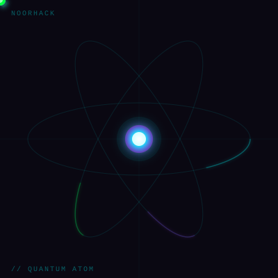
</a>
&nbsp;
<a href="https://noor-alhussain.github.io/Noor-AlHussain/dna/">
  
</a>


<br/>

```
I operate at every layer of the abstraction stack.
From transistors to transformers. No layer untouched.
```


<!-- ════════════════════════════════════════ ZONE 2 — TERMINAL -->

<br/>


<br/>


<!-- ════════════════════════════════════════ ZONE 3 — IDENTITY -->

<br/>

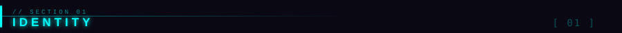

<br/>


<br/>


&nbsp;
[](https://github.com/Noor-AlHussain)
&nbsp;


[](https://github.com/Noor-AlHussain/Noor-AlHussain/actions/workflows/update-readme.yml)
&nbsp;
[](https://github.com/Noor-AlHussain/Noor-AlHussain/actions/workflows/deploy-pages.yml)
&nbsp;
[](https://github.com/Noor-AlHussain/Noor-AlHussain/actions/workflows/tests.yml)
&nbsp;
[](https://github.com/Noor-AlHussain/Noor-AlHussain/actions/workflows/validate-assets.yml)

<!-- LAST_BUILD_BADGE_START -->

<!-- LAST_BUILD_BADGE_END -->
<!-- LOC_BADGE_START -->

<!-- LOC_BADGE_END -->

<br/>


<!-- ════════════════════════════════════════ ZONE 3b — SYSTEM MAP -->

<br/>

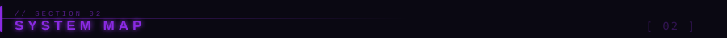

<br/>

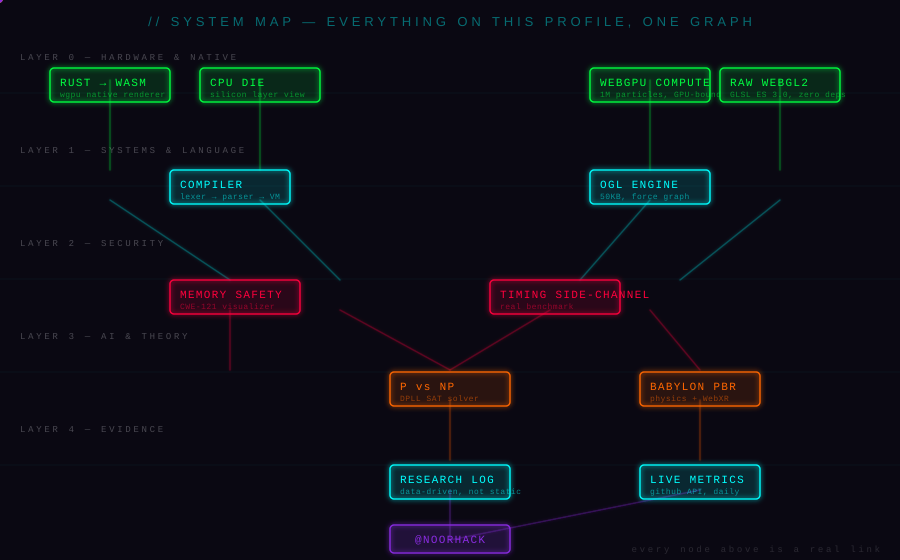

<sub>Static preview above — links inside an `&lt;img&gt;`-embedded SVG don't activate in any browser, GitHub included. The fully clickable version lives on GitHub Pages:</sub>

[](https://noor-alhussain.github.io/Noor-AlHussain/system-map/)

<br/>


<!-- ════════════════════════════════════════ ZONE 4 — LAYER STACK -->

<br/>

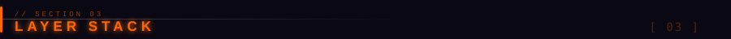

<br/>


<br/>


<!-- ════════════════════════════════════════ ZONE 5 — ARSENAL -->

<br/>

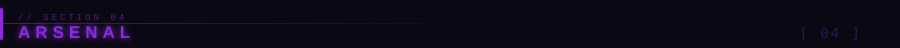

<br/>


<br/>


<br/>

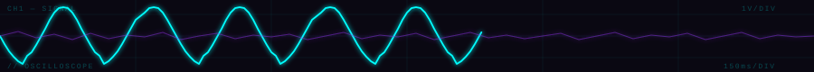

<br/>


<!-- ════════════════════════════════════════ ZONE 6 — 3D UNIVERSE -->

<br/>

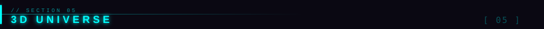

<br/>

> Multi-engine 3D — **Babylon.js PBR** · **WebGPU Compute Shaders** · **Raw WebGL2 GLSL ES 3.0** · **OGL** · **Rust → WASM** · click any preview to enter

<br/>

<a href="https://noor-alhussain.github.io/Noor-AlHussain/atom/">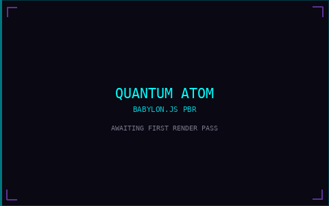</a>
<a href="https://noor-alhussain.github.io/Noor-AlHussain/dna/">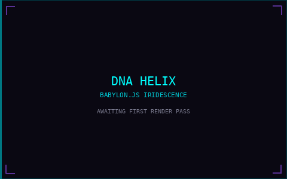</a>
<a href="https://noor-alhussain.github.io/Noor-AlHussain/particles/">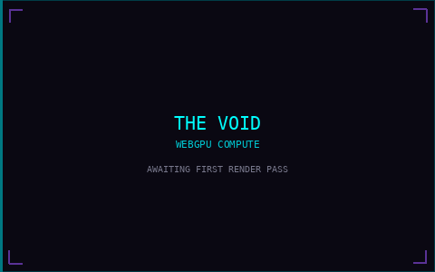</a>

<sub>QUANTUM ATOM · Babylon.js PBR + WebXR</sub>&nbsp;&nbsp;&nbsp;&nbsp;&nbsp;&nbsp;&nbsp;<sub>DNA HELIX · Babylon.js Iridescence</sub>&nbsp;&nbsp;&nbsp;&nbsp;&nbsp;&nbsp;&nbsp;<sub>THE VOID · WebGPU 1M Particles</sub>

<br/>

<a href="https://noor-alhussain.github.io/Noor-AlHussain/universe/">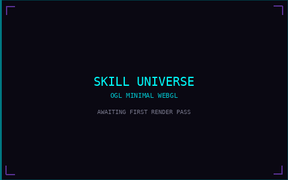</a>
<a href="https://noor-alhussain.github.io/Noor-AlHussain/neural/">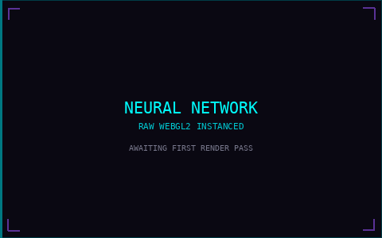</a>
<a href="https://noor-alhussain.github.io/Noor-AlHussain/wormhole/">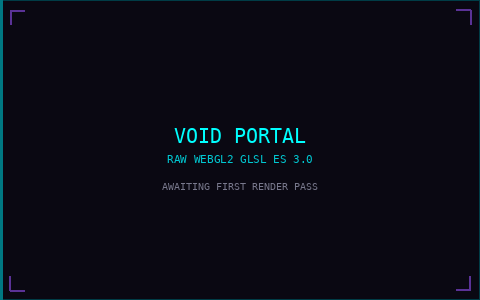</a>

<sub>SKILL UNIVERSE · OGL Force Graph</sub>&nbsp;&nbsp;&nbsp;&nbsp;&nbsp;&nbsp;&nbsp;<sub>NEURAL NET · Raw WebGL2 Instanced</sub>&nbsp;&nbsp;&nbsp;&nbsp;&nbsp;&nbsp;&nbsp;<sub>VOID PORTAL · Raw WebGL2 GLSL ES 3.0</sub>

<br/>

<a href="https://noor-alhussain.github.io/Noor-AlHussain/hologram/">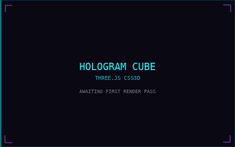</a>
<a href="https://noor-alhussain.github.io/Noor-AlHussain/cpu/">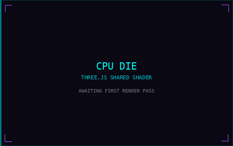</a>
<a href="https://noor-alhussain.github.io/Noor-AlHussain/rust-engine/"></a>

<sub>HOLOGRAM CUBE · Three.js CSS3D</sub>&nbsp;&nbsp;&nbsp;&nbsp;&nbsp;&nbsp;&nbsp;<sub>CPU DIE · Three.js Shared Shader</sub>&nbsp;&nbsp;&nbsp;&nbsp;&nbsp;&nbsp;&nbsp;<sub>VOID-ENGINE · custom renderer, compiled not interpreted</sub>

<br/>

[](https://noor-alhussain.github.io/Noor-AlHussain/)

<br/>
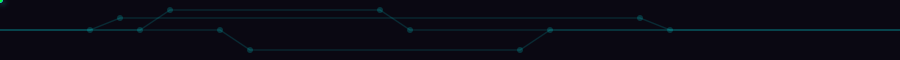

<!-- ════════════════════════════════════════ ZONE 6b — FUNCTIONAL TOOLS -->

<br/>

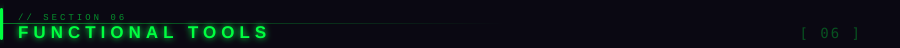

<br/>

> Tools that actually run. Source code visible in `assets/canvas/` — no black boxes.

<br/>

[](https://noor-alhussain.github.io/Noor-AlHussain/compiler-playground/)
&nbsp;
[](https://noor-alhussain.github.io/Noor-AlHussain/memory-visualizer/)

[](https://noor-alhussain.github.io/Noor-AlHussain/timing-demo/)
&nbsp;
[](https://noor-alhussain.github.io/Noor-AlHussain/sat-solver/)

<br/>


<!-- ════════════════════════════════════════ ZONE 6c — RESEARCH LOG -->

<a name="research-log"></a>

<br/>


<br/>

> Data-driven, not static prose — every entry below is rendered directly from `data/research-log.yaml`
> by `scripts/generate-research.js` on every pipeline run. Edit the YAML, not this section.

<br/>

<!-- RESEARCH_LOG_START -->


**[RL-001]** `2025-01-01` — [Compiler pipeline — lexer → parser → bytecode → VM, hand-written in JS](https://noor-alhussain.github.io/Noor-AlHussain/compiler-playground/)

`compilers` `language-design` `javascript`

Built a complete toy-language compiler from scratch: regex lexer, recursive-descent parser producing a typed AST, a stack-based bytecode compiler, and a stepped VM with live register/stack visualization. No parser generator — every stage is hand-rolled.

<br/>


**[RL-002]** `2025-01-01` — [Timing side-channel: naive vs constant-time comparison, measured in-browser](https://noor-alhussain.github.io/Noor-AlHussain/timing-demo/)

`security` `side-channel` `cryptography` `javascript`

Interactive demo that benchmarks 20,000 string comparisons per guess variant, in the visitor's own browser, showing the measurable timing difference between early-exit and constant-time comparison — the same class of vulnerability that motivated HMAC verification in crypto libraries.

<br/>


**[RL-003]** `2025-01-01` — [DPLL SAT solver + exponential blowup visualization](https://noor-alhussain.github.io/Noor-AlHussain/sat-solver/)

`algorithms` `complexity-theory` `P-vs-NP` `sat`

A complete DPLL solver running in the browser, with an animated search tree and a live chart showing measured average DPLL steps from n=2 to n=12 variables at the phase-transition clause density — making the exponential growth visible rather than just stated.
<!-- RESEARCH_LOG_END -->

<br/>


<!-- ════════════════════════════════════════ ZONE 7 — STATS -->

<a name="github-metrics"></a>

<br/>

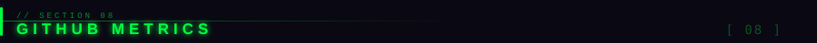

<br/>

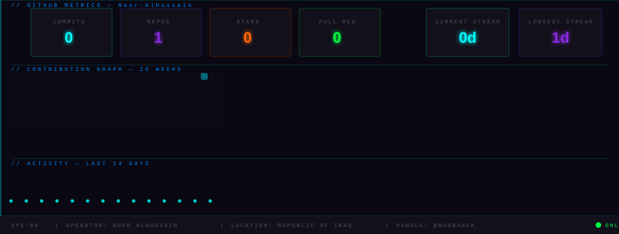

<br/>


<br/>


<!-- ════════════════════════════════════════ ZONE 8 — SIGNAL -->

<br/>

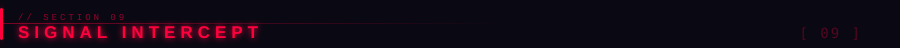

<br/>


<br/>

[](https://github.com/Noor-AlHussain)
&nbsp;
[](https://x.com/NoorHack)
&nbsp;
[](https://www.linkedin.com/in/Noor-AlHussain)
&nbsp;
[](mailto:noorhack.work@gmail.com)
&nbsp;
[](https://github.com/Noor-AlHussain/Noor-AlHussain/blob/main/resume.json)

<br/>


<!-- ════════════════════════════════════════ ZONE 9 — EASTER EGGS
  ╔══════════════════════════════════════════════════════════════════╗
  ║  EASTER EGG ARCHIVE                                              ║
  ║  [01] 4e6f6f7220416c487573736169 6e202d204e6f6f7248 61636b     ║
  ║  [02] SVG metadata → assets/svg/hero/glitch-name.svg            ║
  ║  [03] assets/integrity-manifest.asc — sha256sum -c to verify    ║
  ║       + gh attestation verify --repo Noor-AlHussain/Noor-        ║
  ║         AlHussain assets/integrity-manifest.asc (Sigstore)      ║
  ║  [04] Page source of https://noor-alhussain.github.io/          ║
  ║  [05] Commit history — hidden message in early commits           ║
  ╚══════════════════════════════════════════════════════════════════╝
-->

<!-- ════════════════════════════════════════ ZONE 10 — FOOTER -->

<br/>

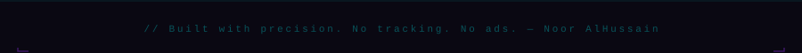


</div>
